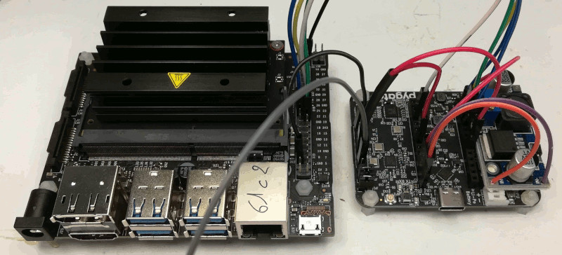

# pyGate-forwarder
[eCOnect] is a European project about biodiversity study in Occitanie (south of France). We'll deploy sensors across large areas and we need a (cheap) way to gather all the data: **LoRaWAN :)**
To achieve this, we make use of the (great)PyGate boards as a (cheap) true 8 channels LoRaWAN packet forwarder: we directly connected our Nvidia Jetson Nano to the PyGate board through SPI bus.



However, while this works seamlessly when connecting a RPi to a PyGate, it turns out to a total mess on Jetson nano ?!?!

**SPOILER**: the reason lies in the fact that SPI on nano does not releases the CS line ... thus SX1308 still waits before executing the received write operation!

## Getting started ##
Reminder: both 'lora_gateway' and 'packet_forwarder' are forks from Semtech version (https://github.com/Lora-net/lora_gateway https://github.com/Lora-net/packet_forwarder)

### Compilation ###
```
cd lora_gateway
make
```
**WARNING** on Nvidia Jetson Nano, you ought to use `make CFLAGS=-DNVIDIA_CS_WORKAROUND`
This stems from a bug in SPI driver.

```
cd packet_fowarder
make
```

### Gateway setup ###
```
cd packet_fowarder/lora_pkt_fwd
cp ~/pyGate-forwarder/*.json .
./update_gwid.sh
```
The `update_gwid.sh` script will generate a new LoRaWAN gateway mac address and update json local file.

  * It's now time for you to modifiy this local file to head your packet forwarder to your LoRaWAN server

  * You ought now to add this new gateway to your LoRaWAN server (we make use of **gotthardp** version https://github.com/gotthardp/lorawan-server)

### packet_forwarder start :) ###
[*MANDATORY*] Reset the board
```
./reset_pygate.py
```
... then start packet forwarder
```
cd packet_forwarder/lora_pkt_fwd
./lora_pkt_fwd
```

and TADA, it works! (at least it ought to ;)
